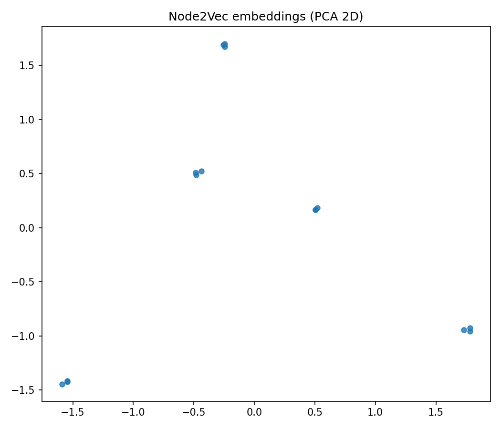

# Disease–Gene Knowledge Graph (Neo4j)

Neo4j-based knowledge graph linking diseases and genes (DisGeNET-style associations).  
Includes Cypher exploration and Node2Vec embeddings + nearest-neighbor and simple link-prediction demos.

## Quick Start
1) Start Neo4j (Docker)
\\\ash
docker run -it --rm -p 7474:7474 -p 7687:7687 -e NEO4J_AUTH=neo4j/neo4j1234 neo4j:5.22
\\\

2) Python 3.11 venv & install
\\\ash
py -3.11 -m venv .venv311
.\.venv311\Scripts\Activate
pip install --only-binary=:all: -r requirements311.txt
\\\

3) Load data
\\\ash
python scripts\load_neo4j.py
\\\

4) Explore in Neo4j Browser (http://localhost:7474)

5) Embeddings
\\\ash
python scripts\embeddings_node2vec.py  # see data/embeddings_pca.png
\\\

## Demos
\\\ash
# Nearest diseases by embedding
python scripts\nearest_neighbors.py --disease "Asthma"

# Candidate genes by embedding (excludes known links)
python scripts\link_prediction_demo.py --disease "Asthma"
\\\

## Schema
\(:Disease {name}) -[:ASSOCIATES_WITH {score}]-> (:Gene {symbol})\

## Tech Stack
Neo4j · Cypher · Python · Py2neo · Pandas · NetworkX · Node2Vec · scikit-learn · Matplotlib
